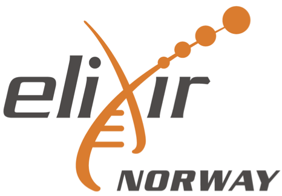

# Genome assembly, annotation and comparative genomics - workshop 2024

This repository contains the course materials for the EBP-Nor Genome Assembly, Annotation and Comparative Genomics, that was given at the [Norwegian Biodiversity Genomics & Conference](https://www.ebpnor.org/english/events/norwegian-biodiversity-and-genomics-conference-202.html). The course is run on infrastructure provdided by [Sigma2](https://www.sigma2.no/).

This workshop is sponsored by EBP-Nor, [Norbis](https://norbis.w.uib.no/) and [Elixir](https://elixir.no/).

  

The workshop consists of three days. 

[Day 1](day1_genome_assembly/README.md) deals with genome assembly, evaluation and curation. 

[Day 2](day2_genome_annotation/README.md) covers genome annotation and introduces comparative genomics.

[Day 3](day3_comparative_genomics/README.md) continues comparative genomics with visualisation of results and ends the day with comparative genomics of repeats.

