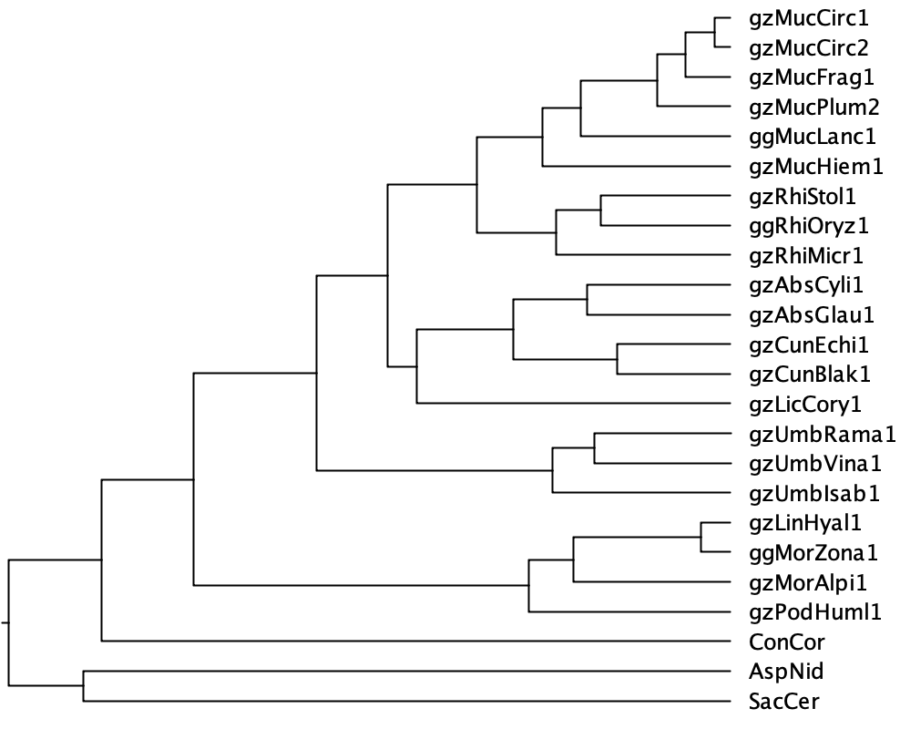

## Running CAFE5

We are going to run CAFE5 on Saga. CAFE5 is already installed on the common workshop project. If you want to install it for your own, please following the instruction at https://github.com/hahnlab/CAFE5.git


### Prepare input files 

CAFE5 needs as input an ultrametric dated species tree

 

and a table of gene count for each gene family.

```
Desc	Family ID	AspNid.pep	ConCor.proteins	SacCer.proteins	ggMorZona1.proteins	ggMucLanc1.proteins
(null)	N0.HOG0000000	1	0	2	2	4 ...
(null)	N0.HOG0000001	1	1	0	0	0 ...
(null)	N0.HOG0000002	0	1	0	0	0 ...
(null)	N0.HOG0000003	1	3	1	2	5 ...
(null)	N0.HOG0000004	0	0	2	0	0 ...
(null)	N0.HOG0000005	0	0	0	0	0 ...
(null)	N0.HOG0000006	0	0	0	0	1 ...
 ...
```

where the first column is the name of the family (if there's any), then the family ID, then the gene
count for each species.

Let first make a folder `cafe` in your home directory, and copy the necessary files from orthofinder results that
we need to generate the input fo `cafe`

```
cd ~
mkdir cafe
cd cafe
cp /cluster/projects/nn9984k/data/orthofinder/Species_Tree/SpeciesTree_rooted_node_labels.txt mucoromycota.nwk
cp /cluster/projects/nn9984k/data/orthofinder/Phylogenetic_Hierarchical_Orthogroups/N0.tsv ./
```

Just want to shorten the species name in the tree by getting rid of `.proteins` and `.pep` at the end.

```
sed -r -i "s#[.]p([^:]+)##g" mucoromycota.nwk 
```

### Dating the species tree

The species tree provided by `orthofinder` is not an ultrametric dated tree. There're several tools that can date a phylogenetic tree using different models. Here, to make it simple, and because we used `orthofinder` before, we will also its tools `make_ultrametric.py` 
to make the tree ultrametric. For this, we just need to specify the age of the root. We are not 
sure about the root age in this case, but based on some literature we guess it's around 850 millions years ago.
Note that this number is not just justified, we just take it's for demonstrating here. 

```
eval "$(/cluster/projects/nn9984k/miniforge3/bin/conda shell.bash hook)" 
conda activate cafe
python3 /cluster/projects/nn9984k/miniforge3/envs/orthofinder/bin/make_ultrametric.py -r 850 mucoromycota.nwk
```

That will generate a dated tree `mucoromycota.nwk.ultrametric.tre` inside the `cafe` folder.


### Generating the gene count table

For the gene count table, we need to count the number of genes in each column (species) for each row (gene family) in the
`N0.tsv` file . This can be done with, for example, an R script as follow. 


```
library(tidyverse)
library(stringr)
N0 <- read_tsv("N0.tsv")
colnames(N0) <- gsub("[.].+","",colnames(N0)) #remove .proteins and .pep and the end of the species name
N0_counts <- lapply(colnames(N0)[4:ncol(N0)], function(species){
  str_count(N0[[species]],",")+1
})
N0_counts <- bind_cols(N0_counts)
N0_counts[is.na(N0_counts)] <- 0
colnames(N0_counts) <- colnames(N0)[4:ncol(N0)]
N0_counts$Desc <- "(null)"
N0_counts$`Family ID` <- N0$HOG  
N0_counts <- select(N0_counts,Desc,`Family ID`, everything())
write_tsv(N0_counts,"mucoromycota_gene_families.txt")
```

We put a copy of this scrip here: `/cluster/projects/nn9984k/scripts/cafe/generate_gene_family_size.R`, so you can run it:

```
#module load R/4.3.2-gfbf-2023a
module load StdEnv R-bundle-CRAN/2023.12-foss-2023a
Rscript /cluster/projects/nn9984k/scripts/cafe/generate_gene_family_size.R
```
<!-- If this does not work, you might have install these packages yourself. Start R by typing R: -->
<!-- ``` -->
<!-- R -->
<!-- ``` -->
<!-- and install these by doing these two commands: -->
<!-- ``` -->
<!-- install.packages('tidyverse') -->
<!-- install.packages('stringr') -->
<!-- ``` -->
<!-- You might have to type `yes` to get it installed in your home area, and you might have to choose a mirror (choose `Norway` with `55`).  (This might take some time.) -->


Or submit a slurm script as the one here: `/cluster/projects/nn9984k/scripts/cafe/runR.sh`

### Running CAFE5

You should now have the 2 files `mucoromycota.nwk.ultrametric.tre` and `mucoromycota_gene_families.txt` in the folder `cafe`. If not, you can copy them from `/cluster/projects/nn9984k/data/cafe`.

<!-- Activate cafe environment to run cafe -->

<!-- ``` -->
<!-- eval "$(/cluster/projects/nn9984k/miniforge3/bin/conda shell.bash hook)" -->
<!-- mamba activate cafe -->
<!-- ``` -->

You can have a look with all available options by typing `cafe5 -h`. We will run it with default setting.

```
cafe5 -i mucoromycota_gene_families.txt -t mucoromycota.nwk.ultrametric.tre -o cafe_results
```

Please don't run the command from the terminal of the login node. Instead of that, put the commands
into a `slurm` script file and submit it to the computing nodes. For example, we have a script here
`/cluster/projects/nn9984k/scripts/cafe/run_cafe.sh` that you can copy and submit.

```
cp /cluster/projects/nn9984k/scripts/cafe/run_cafe.sh ./
sbatch run_cafe.sh
```

Running CAFE5 on our whole mucoromycota dataset would take a couple of hours. If everything goes well, you would have the results this evening and we can look at the results tomorrow morning. Sometime if the data is too large, it is not able to find appropriate initial values to start. In this case you need to reduce your input data, either by removing species, or by removing gene families. For example in our case, you can remove the outgroups species `AspNid`, `SacCer`, `Concor` from the species tree, and try to run again.

For tommorow, we will use your local RStudio. Please make sure to have those R packages installed beforehand: `tidyverse`, `ggplot2`, `ggtree`, `treeio`.
