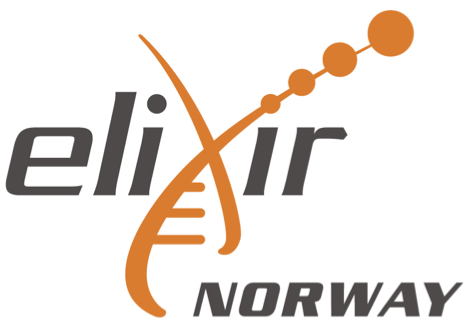

# Genome annotation and comparative genomics, part 1

This repository contains the course materials for the EBP-Nor Genome annotation and comparative genomics Workshop that was given in connection with the [Norwegian Biodiversity Genomics & Conference](https://www.ebpnor.org/english/conference/). The course is run on infrastructure provdided by [Sigma2](https://www.sigma2.no/).

You can grab the slides for [morning here](Genome_assembly_annotation_and_comparative_genomics_day_2_morning.pdf) and [afternoon here](Genome_assembly_annotation_and_comparative_genomics_day_2_afternoon.pdf).

To set up password, go here: [https://www.metacenter.no/user/reset/](https://www.metacenter.no/user/reset/).

Part 2 of the workshop builds further on this and can be found [here](https://github.com/ebp-nor/workshop-2024/tree/main/day3_comparative_genomics). 

This workshop is sponsored by [EBP-Nor](https://www.ebpnor.org/), [Norbis](https://norbis.w.uib.no/) and [Elixir](https://elixir.no/).

  

##  Genome annotation and comparative genomics, part 1 - Schedule

### 09:00-12:00 Genome annotation

* 09:00-09:30 [Introduction to the study system and comparative genomeics](00_introduction.md)
  * Submit the first set of jobs
    * [Repeat mask](01_repeatmasking.md)
    * [Mapping protein sets](02_miniprot.md)
    * [_Ab initio_ gene prediction](03_galba.md)
* 09:30-11:55 [Introduction to genome annotation](slides_morning.pdf)
  * Work through the rest of the programs
    * [EvidenceModeler](04_evm.md)
    * [BUSCO](05_busco.md)
    * [Functional annotation](06_functional.md)
    * Coffee break 10:00-10:15
* 11:55-12:00 Summary

### 12:00-13:00 Lunch

### 13:00-14:00 
* [Introduction to OrthoFinder](slides_afternoon.pdf)
* [Setting up and running OrthoFinder](orthofinder.md)

### 14:00-14:15 Break

### 14:15-16:00 
* [Basic visualization of Orthofinder results in R](https://html-preview.github.io/?url=https://raw.githubusercontent.com/ebp-nor/workshop-2024/main/day2_genome_annotation/Orthofinder_stats_2024.html)
* [Introduction to gene family evolution analyses with CAFE5](Introduction_to_CAFE.pdf)
* [Setting up and running CAFE5](CAFE5.md)

