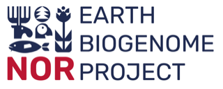

# Genome annotation and comparative genomics, part 1

This repository contains the course materials for the workshop Genome annotation and comparative genomics, part 1 created for the Oslo Bioinformatics Workshop Week 2023 and taught by people in the EBP-Nor project. The course is run on infrastructure provided by the University of Oslo. 

Part 2 of the workshop builds further on this and can be found [here](https://github.com/ebp-nor/genome_annotation_comparative_genomics_part2). 

This workshop is sponsored by EBP-Nor in addition to the sponsors for the Oslo Bioinformatics Workshop Week 2023 itself. 

##  Genome annotation and comparative genomics, part 1 - Schedule

### 09:00-12:00 Genome annotation

* 09:00-09:30 [Introduction to the study system and infrastructure](00_introduction.md)
  * Making sure you have access to Fox
  * Submit the first set of jobs
    * [Repeat mask](01_repeatmasking.md)
    * [Mapping protein sets](02_miniprot.md)
    * [_Ab initio_ gene prediction](03_galba.md)
* 09:30-11:55 [Introduction to genome annotation](slides_morning.pdf)
  * Work through the rest of the programs
    * [EvidenceModeler](04_evm.md)
    * [BUSCO](05_busco.md)
    * [Functional annotation](06_functional.md) 
* 11:55-12:00 Summary

### 12:00-13:00 Lunch

### 13:00-14:00 
* [Introduction to comparative genomics](slides_afternoon.pdf)
* [Setting up OrthoFinder](orthofinder.md)

### 14:00-14:15 Break

### 14:15-16:00 
* Running OrthoFinder on proteins and CDS
