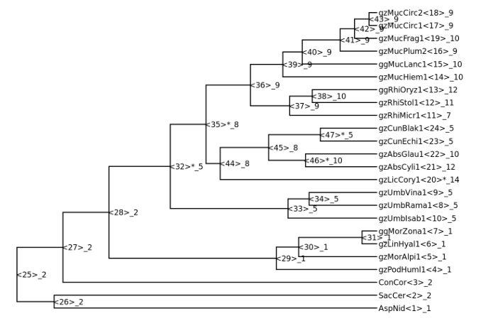
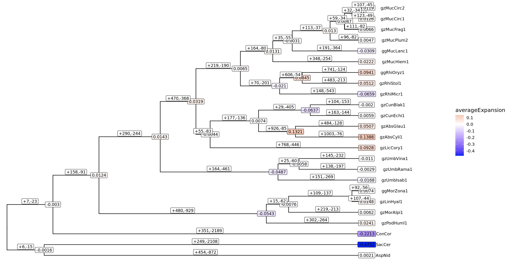

## Looking at the results of CAFE5

If you have submitted the cafe job yesterday, you should now have the results in the folder `~/cafe/cafe_results`. If for some reason, you don't have it, there's a copy of it here `/cluster/projects/nn9984k/data/cafe/cafe_results`, and also on github page under the subfolder `data/cafe`.

We are going to look at the results on your local Rstudio, so if you haven't already done, please first copy/download the `data` folder on your local computer.

Make sure that you have the R packages `treeio, ggtree, ggplot2, tidyverse` installed.

### The asr gene family trees

The file `Base_asr.tre` contains the trees with gene count for each gene family at each node.
We can read this file in `R`:

```
library(treeio)
asr_trees <- read.nexus('data/cafe/cafe_results/Base_asr.tre')
```

We have given `17594` gene family as input, but there are only `5241` trees here. That was because the program had discarded all gene families infer `0` copy at the root.
Let plot 1 on these trees, the 5th one for example.

```
library(ggtree)
ggtree(asr_trees[[5]]) +  hexpand(.5) +
  geom_tiplab(size=3) + geom_nodelab(size=3, hjust = 0.1) 
```

 

The `<node_id>` of each node is in the bracket `<>`, follows by the count of the gene of this family at this node. 
Sometimes there's a star after the node id, which indicates that the changing of family size is significant at that branch.


### Other statistics files

The file `Base_family_results.txt` shows us which gene family has undergone at least 1 significant change in the past.

```
#FamilyID       pvalue  Significant at 0.05
N0.HOG0000000   0.113   n
N0.HOG0000001   0.064   n
N0.HOG0000003   0.379   n
N0.HOG0000004   0.169   n
N0.HOG0000007   0.001   y
N0.HOG0000008   0.248   n
N0.HOG0000010   0.042   y
N0.HOG0000012   0.379   n
N0.HOG0000013   0.034   y
...
```

The file `Base_count.tab` tells us the number of genes in each gene family at each node.

```
FamilyID	AspNid<1>	SacCer<2>	ConCor<3>	gzPodHuml1<4>	gzMorAlpi1<5>	…	<29>	<30>	<31>	…
N0.HOG0000000	1	2	0	2	2	…	2	2	2	…
N0.HOG0000001	1	0	1	0	0	…	0	0	0	…
N0.HOG0000003	1	1	3	2	2	…	2	2	2	…
N0.HOG0000004	0	2	0	0	0	…	0	0	0	…
N0.HOG0000007	1	2	2	1	1	…	1	1	1	…
N0.HOG0000008	1	0	0	0	0	…	0	0	0	…
N0.HOG0000010	0	1	1	0	0	…	0	0	0	…
N0.HOG0000012	0	1	2	0	0	…	0	0	0	…
...
```

The file `Base_change.tab` gives us the differences between each node and its parent node for each gene family. A negative value corresponds to a contraction event, and a positive value corresponds to an
expansion event.

```
FamilyID	AspNid<1>	SacCer<2>	ConCor<3>	gzPodHuml1<4>	gzMorAlpi1<5>	…	<29>	<30>	<31>	…
N0.HOG0000000	-1	0	-2	0	0	…	0	0	0	…
N0.HOG0000001	0	-1	0	0	0	…	-1	0	0	…
N0.HOG0000003	-2	-2	0	0	0	…	-1	0	0	…
N0.HOG0000004	-1	1	-1	0	0	…	-1	0	0	…
N0.HOG0000007	-1	0	0	0	0	…	-1	0	0	…
N0.HOG0000008	0	-1	-1	0	0	…	-1	0	0	…
N0.HOG0000010	-1	0	0	0	0	…	-1	0	0	…
N0.HOG0000012	-1	0	1	0	0	…	-1	0	0	…
...
```

The file `Base_clade_results.txt` tells us the number of gene families that have increase or decrease at each node.

```
#Taxon_ID       Increase        Decrease
<30>    15      62
<31>    109     137
<29>    480     929
<43>    32      34
gzPodHuml1<4>   302     264
gzMucPlum2<16>  96      82
<27>    7       23
ConCor<3>       351     2189
<28>    158     91
AspNid<1>       454     872
SacCer<2>       249     2108
gzMorAlpi1<5>   219     213
<26>    6       15
gzLinHyal1<6>   107     44
ggMorZona1<7>   92      56
<40>    35      55
...
```

Let read those files 

```
library(tidyverse)
counts <- read_tsv("data/cafe/cafe_results/Base_count.tab")
countSum <- colSums(counts[,-1]) # calculate the total gene count over all family at each node
changes <- read_tsv("data/cafe/cafe_results/Base_change.tab")
changeSum <- colSums(changes[,-1]) # calculate the total changes over all family at each node
clade <- read_tsv("data/cafe/cafe_results/Base_clade_results.txt", comment = '#',col_names =  c("node_id","expand","contract"))
```

Combine them into a data frame:

```
info <- data.frame(node_id = colnames(counts)[-1]) %>%
  mutate(node = gsub(".*<(.+)>","\\1",node_id),
         S = gsub("(.*)<.+","\\1",node_id),
        count = countSum,
        change = changeSum) %>% 
  left_join(clade)
```

Calculate the average expansion simply as `change/count`
```
info <- mutate(info, averageExpansion = change/count)
```

### Plot the statistics information on the species tree 

Read the species tree

```
speciesTree <- read.tree("data/cafe/mucoromycota.nwk.ultrametric.tre")
speciesTree <- as.treedata(speciesTree)
```

Attach `info` to the data of the species tree
```
speciesTree@data <- as_tibble(info)
```

Plot species tree with wanted `info` on the corresponding branches

```
ggtree(speciesTree) + geom_tiplab(size=3, hjust = -0.5) + hexpand(.1) +
  geom_label(data = . %>% filter(change!=0), 
            aes(label=round(averageExpansion,4), fill = averageExpansion), size = 3) +
  scale_fill_gradient2(low = "blue",high = "red") +
  geom_label(data = . %>% filter(!is.na(expand)), 
            aes(x=branch, label = paste0("+",expand,",-",contract)), size = 3, vjust = -0.1)
```

 


### Installing the R packages

To install the R packages, you might have to do this in R:
```
#from https://bioconductor.org/install/
if (!require("BiocManager", quietly = TRUE))
    install.packages("BiocManager")
BiocManager::install(version = "3.18")
BiocManager::install("treeio")
BiocManager::install("ggtree")
install.packages('ggplot')
install.packages('tidyverse')
```

