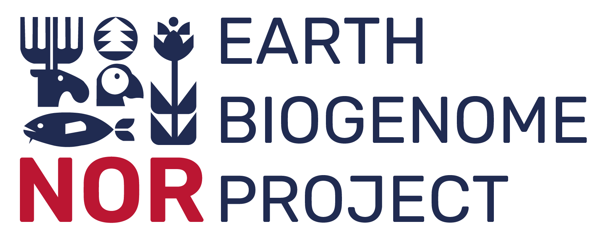

# Genome annotation and comparative genomics, part 2

This repository contains the course materials for the workshop Genome annotation and comparative genomics, part 2 created for the Oslo Bioinformatics Workshop Week 2023 and taught by people in the EBP-Nor project. The course is run on infrastructure provided by the University of Oslo. 

You can find part 1 [here](https://github.com/ebp-nor/genome_annotation_comparative_genomics_part1). You should be able to follow this workshop independently of part 1, but it might give some background that is useful.

This workshop is sponsored by EBP-Nor and [Norbis](https://norbis.w.uib.no/).

##  Genome annotation and comparative genomics, part 2 - Schedule

### 09:00-12:00 Visualizing and interpreting comparative genomics results

* 09:00-10:00 Recap of comparative genomics results 
 
* 10:00-10:15 Break

* 10:15-12:00 Visualizing comparative genomics results in R

### 12:00-13:00 Lunch

### 13:00-16:00 Genomic repeats
* 13:00-14:00 Transposable element evolution 
* 14:00-14:15 Break
* 14:15-15:45 Visualization and analyses of repeats in R
* 15:45-16:00 Evaluation and final words
